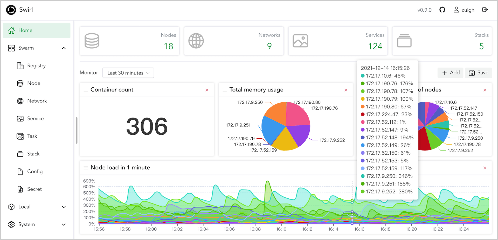

# SWIRL

[](https://hub.docker.com/r/cuigh/swirl/)
[](https://goreportcard.com/report/cuigh/swirl)

**Swirl** is a web management tool for Docker, focused on swarm cluster.

## Features

* Swarm components management
* Image and container management
* Compose management with deployment support
* Service monitoring based on Prometheus
* Service auto scaling
* LDAP authentication support
* Full permission control based on RBAC model
* Scale out as you want
* Multiple language support
* And more...

## Snapshots

### Home



### Service list


### Compose list


### Role editing


### Settings


## Configuration

### With config file

All options can be set with `config/app.yml`.

```yaml
name: swirl
banner: false

web:
  address: ':8001'
  authorize: '?'

swirl:
  db_type: mongo
  db_address: localhost:27017/swirl
#  docker_endpoint: tcp://docker-proxy:2375

log:
  loggers:
  - level: info
    writers: console
  writers:
  - name: console
    type: console
    layout: '[{L}]{T}: {M}{N}'
```

### With environment variables

Only three main options can be set by environment variables for now.

| Name            | Value                                           |
| --------------- | ------------------------------------------------|
| DB_TYPE         | mongo                                           |
| DB_ADDRESS      | localhost:27017/swirl                           |
| DOCKER_ENDPOINT | tcp://docker-proxy:2375                         |

### With swarm config

Docker support mounting configuration file through swarm from v17.06, so you can store your config in swarm and mount it to your program.

## Deployment

### Stand alone

Just copy the swirl binary and config/assets/views directories to the host, and run it.

```bash
./swirl
```

### Docker

```bash
docker run -d -p 8001:8001 \
    --mount type=bind,src=/var/run/docker.sock,dst=/var/run/docker.sock \
    -e DB_TYPE=mongo \
    -e DB_ADDRESS=localhost:27017/swirl \
    --name=swirl \
    cuigh/swirl
```

### Docker swarm

```bash
docker service create \
  --name=swirl \
  --publish=8001:8001/tcp \
  --env DB_ADDRESS=localhost:27017/swirl \
  --constraint=node.role==manager \
  --mount=type=bind,src=/var/run/docker.sock,dst=/var/run/docker.sock \
  cuigh/swirl
```

### Docker compose

```bash
docker stack deploy -c compose.yml swirl
```

## Advanced features

**Swirl** use service labels to support some features, the labels in the table below are currently supported.

Name | Description | Examples
--- | --- | ---
swirl.scale | Service auto scaling | `swirl.scale=min=1,max=5,cpu=30:50`
swirl.metrics | Add additional metrics to service stats page | `swirl.metrics=java`, `swirl.metrics=go`

## Build

**Swirl** use `dep` as dependency management tool. You can build **Swirl**

```sh
$ dep ensure
$ go build
```

## License

This product is licensed to you under the MIT License. You may not use this product except in compliance with the License. See LICENSE and NOTICE for more information.