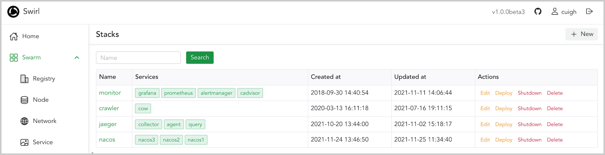

# SWIRL

[](https://hub.docker.com/r/cuigh/swirl/)
[](https://goreportcard.com/report/cuigh/swirl)

**Swirl** is a web management tool for Docker, focused on swarm cluster.

> Warning: v1.0+ is not fully compatible with previous versions, it is recommended to redeploy instead of upgrading directly.

## Features

* Swarm components management
* Image and container management
* Compose management with deployment support
* Service monitoring based on [Prometheus](https://hub.docker.com/r/cuigh/prometheus/) and [cadvisor](https://github.com/google/cadvisor)
* Service auto scaling
* LDAP authentication support
* Full permission control based on RBAC model
* Scale out as you want
* Multiple language support
* And more...

## Snapshots

### Home


### Service list


### Service stats


### Stack list



### Settings


## Configuration

### With config file

All options can be set with `config/app.yml`.

```yaml
name: swirl
banner: false

web:
  entries:
    - address: :8002
  authorize: '?'

swirl:
  db_type: mongo
  db_address: mongodb://localhost:27017/swirl
#  token_key: 80fe9a6d5c6d5dd39f27cd37a77faf8a
#  token_expiry: 30m
#  docker_api_version: '1.41'
#  docker_endpoint: tcp://docker-proxy:2375

log:
  loggers:
  - level: info
    writers: console
  writers:
  - name: console
    type: console
    layout: '[{L}]{T}: {M}{N}'
```

### With environment variables

Only these options can be set by environment variables for now.

| Name               | Value                            |
|--------------------|----------------------------------|
| DB_TYPE            | mongo(default),bolt              |
| DB_ADDRESS         | mongodb://localhost:27017/swirl  |
| TOKEN_KEY          | 80fe9a6d5c6d5dd39f27cd37a77faf8a |
| TOKEN_EXPIRY       | 30m                              |
| DOCKER_ENDPOINT    | tcp://docker-proxy:2375          |
| DOCKER_API_VERSION | 1.41                             |

### With swarm config

Docker support mounting configuration file through swarm from v17.06, so you can store your config in swarm and mount it to your program.

## Deployment

Swirl support two storage engines now: mongo and bolt. **bolt** is suitable for development environment, **Swirl** can only deploy one replica if you use **bolt** storage engine.

### Standalone

Just copy the swirl binary and config directory to the host, and run it.

```bash
./swirl
```

### Docker

* Use **bolt** storage engine

```bash
docker run -d -p 8001:8001 \
    -v /var/run/docker.sock:/var/run/docker.sock \
    -v /data/swirl:/data/swirl \
    -e DB_TYPE=bolt \
    -e DB_ADDRESS=/data/swirl \
    --name=swirl \
    cuigh/swirl
```

* Use **MongoDB** storage engine

```bash
docker run -d -p 8001:8001 \
    --mount type=bind,src=/var/run/docker.sock,dst=/var/run/docker.sock \
    -e DB_TYPE=mongo \
    -e DB_ADDRESS=mongodb://localhost:27017/swirl \
    --name=swirl \
    cuigh/swirl
```

### Docker swarm

* Use **bolt** storage engine

```bash
docker service create \
  --name=swirl \
  --publish=8001:8001/tcp \
  --env DB_TYPE=bolt \
  --env DB_ADDRESS=/data/swirl \
  --constraint=node.hostname==manager1 \
  --mount=type=bind,src=/var/run/docker.sock,dst=/var/run/docker.sock \
  --mount=type=bind,src=/data/swirl,dst=/data/swirl \
  cuigh/swirl
```

* Use **MongoDB** storage engine

```bash
docker service create \
  --name=swirl \
  --publish=8001:8001/tcp \
  --env DB_ADDRESS=mongodb://localhost:27017/swirl \
  --constraint=node.role==manager \
  --mount=type=bind,src=/var/run/docker.sock,dst=/var/run/docker.sock \
  cuigh/swirl
```

### Docker compose

```bash
docker stack deploy -c compose.yml swirl
```

## Advanced features

**Swirl** use service labels to support some features, the labels in the table below are currently supported.

| Name        | Description          | Examples                            |
|-------------|----------------------|-------------------------------------|
| swirl.scale | Service auto scaling | `swirl.scale=min=1,max=5,cpu=30:50` |

## Build

To build **Swirl** from source, you need `yarn` and `go(v1.16+)` installed.

```sh
$ cd ui 
$ yarn
$ yarn build
$ cd ..
$ go build
```

## License

This product is licensed to you under the MIT License. You may not use this product except in compliance with the License. See LICENSE and NOTICE for more information.